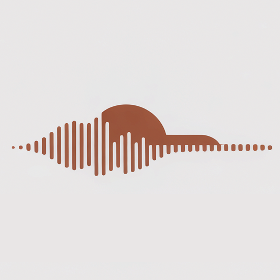
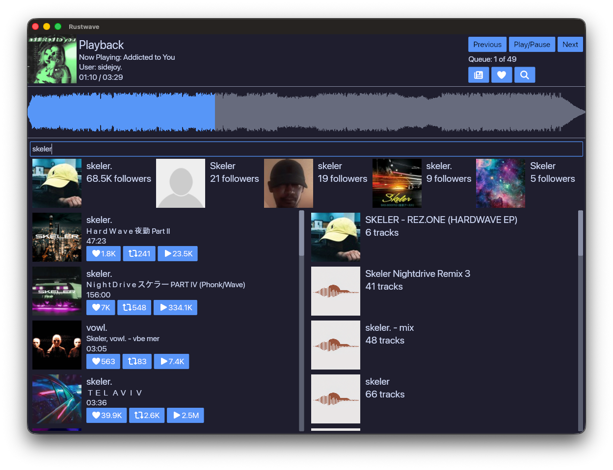
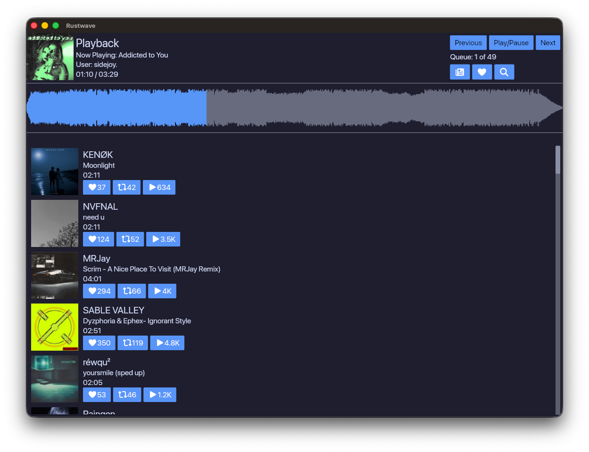

<p align="center">
    
<br>
<a href="https://github.com/IxianPixel/rustwave/releases/latest">
    
</a>
<a href="https://github.com/IxianPixel/rustwave/actions/workflows/ci.yml">
    
</a>
<a href="https://github.com/IxianPixel/rustwave/actions/workflows/release.yml">
    
</a>
</p>

## Table of Contents

- [About](#about)
- [Installation](#installation)
- [Screenshots](#screenshots)
- [Acknowledgement](#acknowledgement)

## About

Rustwave is a SoundCloud client written entirely in Rust. It is still under heavy development with features being added
regularly. The goal is to reach feature parity with the official SoundCloud. The current feature set includes:

- Loading Feed
- Loading Likes
- Searching
    - Tracks
    - Users
    - Playlists
- Liking Tracks
- Playing Tracks
- Full Integration with OS Media Controls

## Installation

### Requirements

A SoundCloud account is **required**

#### Dependencies

##### Windows and MacOS

- [Rust and cargo](https://www.rust-lang.org/tools/install) as the build dependencies

##### Linux

- [Rust and cargo](https://www.rust-lang.org/tools/install) as the build dependencies
- Install `openssl`, `alsa-lib` (`streaming` feature), `libdbus` (`media-control` feature).

    - For example, on Debian based systems, run the below command to install application's dependencies:

      ```shell
      sudo apt install libssl-dev libasound2-dev libdbus-1-dev
      ```

    - On RHEL/Fedora based systems, run the below command to install application's dependencies :

      ```shell
      sudo dnf install openssl-devel alsa-lib-devel dbus-devel
      ```

      or if you're using `yum`:

      ```shell
      sudo yum install openssl-devel alsa-lib-devel dbus-devel
      ```

### Building

At the moment you need to clone to repo and build it yourself.

#### MacOS

- A build script is provided to build the application on macOS. This will generate an application bundle in the root
  directory.

    ```shell
    git clone https://github.com/IxianPixel/rustwave.git
    cd rustwave
    ./build_app.sh
    ```

#### Windows and Linux

- Build the application using cargo. This will generate an executable in the `target/release` directory.

    ```shell
    git clone https://github.com/IxianPixel/rustwave.git
    cd rustwave
    cargo build --release
    ```

## Screenshots

### Search

<p align="center">
    
</p>

### Feed

<p align="center">
    
</p>

## Acknowledgement

Rustwave is written in [Rust](https://www.rust-lang.org) and is built on top of awesome libraries such
as [Iced](https://github.com/iced-rs/iced), [rodio](https://github.com/RustAudio/rodio), [souvlaki](https://github.com/Sinono3/souvlaki),
and [many more](Cargo.toml).
